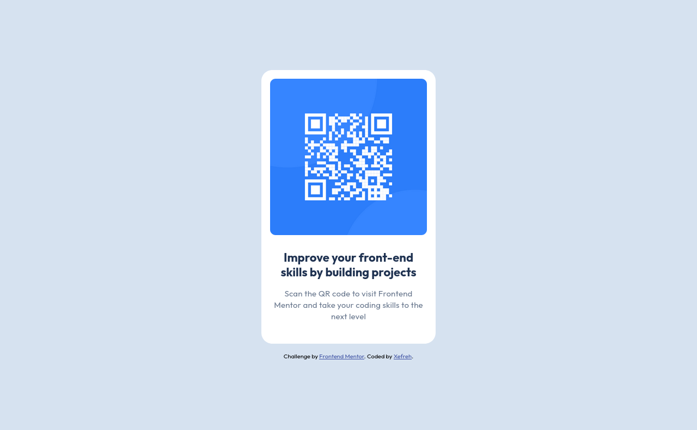

# Frontend Mentor - QR code component solution

This is a solution to the [QR code component challenge on Frontend Mentor](https://www.frontendmentor.io/challenges/qr-code-component-iux_sIO_H). Frontend Mentor challenges help you improve your coding skills by building realistic projects.

## Table of contents

- [Overview](#overview)
  - [Screenshot](#screenshot)
  - [Links](#links)
- [My process](#my-process)
  - [Built with](#built-with)
  - [What I learned](#what-i-learned)
  - [Continued development](#continued-development)
  - [Useful resources](#useful-resources)
- [Author](#author)
- [Acknowledgments](#acknowledgments)

**Note: Delete this note and update the table of contents based on what sections you keep.**

## Overview

### Screenshot

### Links

- Solution URL: [Add solution URL here](https://your-solution-url.com)
- Live Site URL: [Add live site URL here](https://your-live-site-url.com)

## My process

### Built with

- HTML
- CSS
- Flexbox

### What I learned

I learned how to use html and css, more specifically concepts like flexbox and also how to integrate a figma design and translate it into a page while trying to follow all the details.

### Useful resources

- [Mdn docs](https://developer.mozilla.org/fr/) - This helped me a lot to found out how to use css properties I used in this project.

## Author

- Website - [Xefreh](https://www.your-site.com)
- Frontend Mentor - [@xefreh](https://www.frontendmentor.io/profile/xefreh)
- Twitter - [@xefreh](https://www.twitter.com/xefreh)
